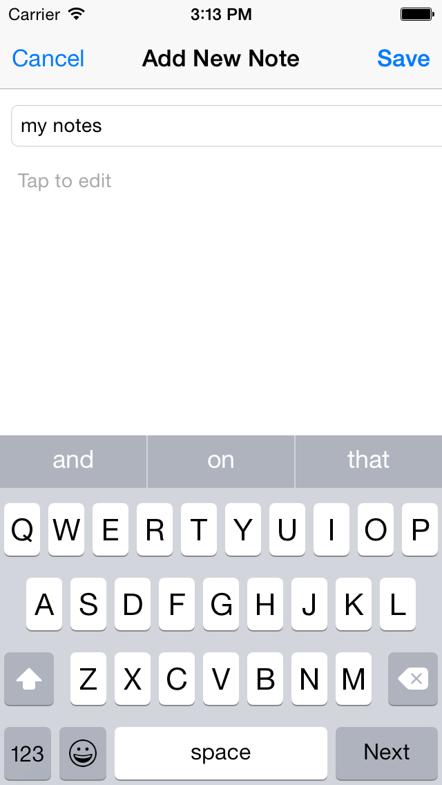
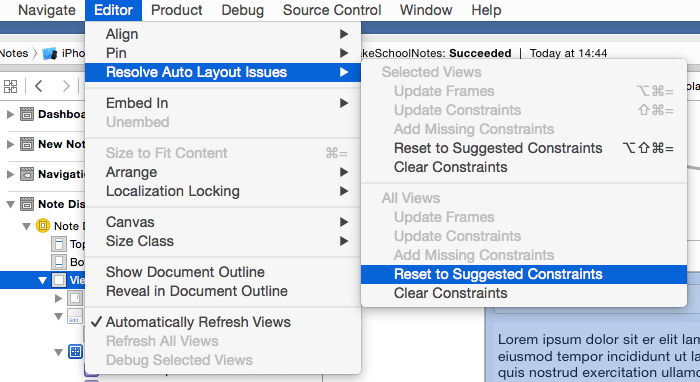
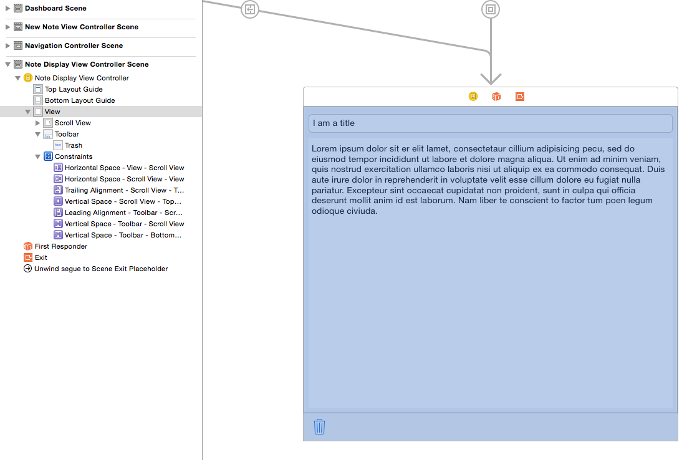
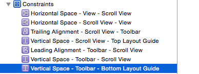
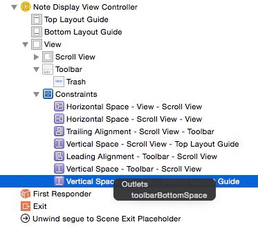
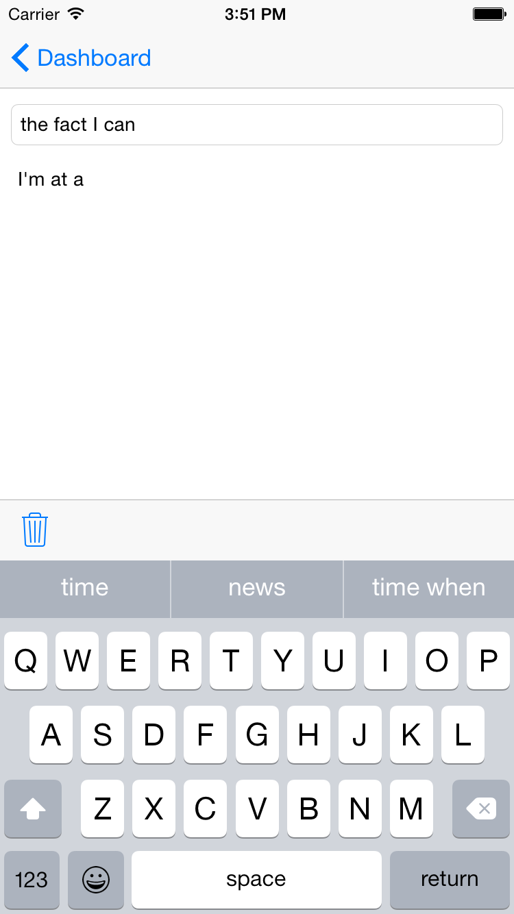

---
title: "Keyboard Input"
slug: keyboard-input
---     

##Keyboard Handling

In our app keyboard handling for the most part *just works*. However the user experience is not optimal.

When you want to add a new note you would expect the keyboard to auto-activate and set focus to the title field, 
if you are viewing an existing note then you would expect the note to be displayed (with the option to edit) and only present the keyboard when a field is clicked on. 

How does the app know if we want to edit/create or view a new note? Well it doesn't of course, you will need to implement this logic.
You can create an `edit` variable that can be set in much the same way as the display note however it's a good time to think about design
from a user experience perspective and how we can infer behaviour logic.

For example if a Note has no title or content it stands to reason that you would want to edit it by default as an empty note isn't very informative.
Let's add an `edit` variable flag and have it set when a `didSet` is called on our note.

> [action]
> Open `NoteDisplayViewController`and add a new `edit` boolean variable to this class and set it to a default value of `false`.
>
Now modify `func viewWillAppear` as follows:
>
	override func viewWillAppear(animated: Bool) {
        super.viewWillAppear(animated)
>        
        displayNote(self.note)
>    
        titleTextField.returnKeyType = .Next //1
        titleTextField.delegate = self       //2
>        
    }
>
> - 1 We are renaming the 'Return' button on the keyboard to 'Next', for our app it makes more sense from a user experience perspective that you most likely
> want to move onto the next input field after entering the title.  We can handle this in the `UITextFieldDelegate` soon.
> - 2 Set the `titleTextField` delegate, we will implement the delegate as a class extension as we did with our Table View Delegate.

Time to set our edit flag status based upon the note content.

##First Responder

> [action]
> Modify `func displayNote` as follows:
>
    func displayNote(note: Note?) {
        if let note = note, titleTextField = titleTextField, contentTextView = contentTextView  {
            titleTextField.text = note.title
            contentTextView.text = note.content
>            
            if count(note.title)==0 && count(note.content)==0 { //1
                titleTextField.becomeFirstResponder()
            }
        }
    }
>    
> - 1 Check the length of our note content strings, if there is no content assume 'Edit' mode and set the first responder, this will set focus to the titleTextField.
and prompt the user with the keyboard ready for title input. 
> If we are not in edit mode then the note will be displayed as is and no keyboard will popup until the user initiates this action for themselves.
 
We still need to add delegate for our textField.

##Adding UITextFieldDelegate
 
> [action]
> Add the following extension code:
> 
    extension NoteDisplayViewController: UITextFieldDelegate {
>    
        func textFieldShouldReturn(textField: UITextField) -> Bool {
>            
            if (textField == titleTextField) {  //1
                contentTextView.becomeFirstResponder()
                contentTextView.returnKeyType = .Done
            }
>            
            return false
        }
    }
>    

1. When the 'Return' button is pressed or in our case 'Next' this delegate will be called, we need to check that the `textField` in question is our `titleTextField` if so then
move the user input onto editing the `contentTextView` leading to a nicer user experience.
 
 
 
Great we can finally allow the user to manage their note content.

##Hold Up

Hmm did you stpo that the bottom toolbar is no longer visible when editing a note? 
The keyboard appears over the top and our toolbar is no longer visible. Well in this case it doesn't make a great difference to the user experience however 
it's good to know how you could do it as there will be times you do want to have this functionality available.

Let's set the scene for some constraint magic.

##Constraint Connection

> [action]
> Add the following variables to your `NoteDisplayViewController`
>
    @IBOutlet weak var deleteButton: UIBarButtonItem!
    @IBOutlet weak var toolbarBottomSpace: NSLayoutConstraint!
>
    var keyboardNotificationHandler: KeyboardNotificationHandler?
>
>
> Connect the `deleteButton` outlet to your trash can button in the toolbar.

> The Layout is a little tricker as you need to ensure it's the correct one. 
>
> Open the `Storyboard` remove all constraints from this `Scene`, select `View` and
then we are going to let `Auto Layout` resolve everything for us and setup all the constraints. In Apple we trust..
>
> From the main menu select `Editor\Resolve Auto Layout Issues\(All Views) Reset to suggested constraints`
>
> 
>
> You view and constraints should look like this:
> 
> 

Now when the keyboard popups we want to move the toolbar to be positioned above the keyboard.  
So the constraint we will want to modify will be the vertical space between the bottomof the view and the toolbar.

> [action]
> Now Ctrl-Drag from your `Note Display View Controller` to the `Vertical Space - Toolbar - Bottom Layout Guide` and select your `toolbarBottomSpace` outlet.
>
> 
>
> Great the constraint is connected, if you run the app it will not do anything special just yet.  

Next we need to ensure we are informed of the keyboard so when it popups we can move the toolbar and when the keyboard disappears it will be returned to the bottom.

The **MakeSchool ConvenienceKit** helps us out here by wrapping things up a little bit so handling these notifications is super simple.  

##Keyboard Notifications

> [action]
> Add the following code into your `func viewWillAppear`:
>
    keyboardNotificationHandler = KeyboardNotificationHandler()
>        
        keyboardNotificationHandler!.keyboardWillBeHiddenHandler = { (height: CGFloat) in
            UIView.animateWithDuration(0.3, animations: { () -> Void in
                self.toolbarBottomSpace.constant = 0
            })
        }
>        
        keyboardNotificationHandler!.keyboardWillBeShownHandler = { (height: CGFloat) in
            UIView.animateWithDuration(0.3, animations: { () -> Void in
                self.toolbarBottomSpace.constant = -height
            })
        }
>
        
We assign the `KeyboardNotificationHandler` so we will be informed of keyboard notification events.  You can see how easily we can now modify the `toolbarBottomSpace` value depending
on the keyboard notification.  We use `-height` as we want to push the toolbar up from the bottom of the view.

Run your app, looking much nicer.

##The Trash Can

However one last niggle, the trash can is still enabled when creating a new note, this doesn't make a whole lot of sense, let's disable it.  

> [action]
> Add the following code to `func viewWillAppear`:
>
    if edit {
        deleteButton.enabled = false
    }
>

Great however how do we know when we are in edit mode.  In this case we want to set `edit` to true when we are in the `New Note View Controller`.
Open this controller and look at the `prepareForSegue` function code. 
Notice that when we set the `NoteDisplayViewController` note, we can also set the edit variable. 

> [action]
> Add the following modifcation after the note is set.
>    
    noteViewController.edit = true
>

Now run the app...

What do we do when the user starts to gather a lot of notes and instead of 5 entries they have 100 entries?

Good time to **Commit your code**.

Some search functionality in our dashboard would be nice.  Let's tackle that in the next chapter....
